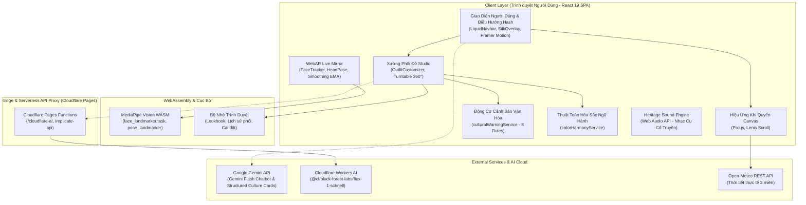

# 🇻🇳 Việt Phục Remix (Viet Phuc Remix)
> **Nền tảng Web Khám phá Di sản, Phối đồ Cổ phục Thông minh & Thử đồ Thực tế Tăng cường WebAR**

[](https://react.dev/)
[](https://vitejs.dev/)
[](https://ai.google.dev/)
[](https://developers.google.com/mediapipe)
[](https://pixijs.com/)
[](https://pages.cloudflare.com/)
[-000000?style=flat-square&logo=bun&logoColor=white)](https://bun.sh/)
[](LICENSE)

---

## 📖 Mục Lục
1. [Giới thiệu Dự án](#-giới-thiệu-dự-án)
2. [Điểm khác biệt & Bài toán giải quyết](#-điểm-khác-biệt--bài-toán-giải-quyết)
3. [Các Phân Hệ & Tính Năng Nổi Bật](#-các-phân-hệ--tính-năng-nổi-bật)
   - [1. Trang chủ & Không gian Khí quyển Thời gian thực](#1-trang-chủ--không-gian-khí-quyển-thời-gian-thực)
   - [2. Xưởng Phối Đồ Thông Minh (Smart Mixer Studio)](#2-xưởng-phối-đồ-thông-minh-smart-mixer-studio)
   - [3. Động Cơ Cảnh Báo Văn Hóa Điển Chế (Cultural Warning Engine)](#3-động-cơ-cảnh-báo-văn-hóa-điển-chế-cultural-warning-engine)
   - [4. Gương Ảo WebAR Trải Nghiệm Tức Thì (WebAR Live Mirror)](#4-gương-ảo-webar-trải-nghiệm-tức-thì-webar-live-mirror)
   - [5. Khung Xem Xoay 360° Đa Góc Nhìn (360° Turntable Viewer)](#5-khung-xem-xoay-360-đa-góc-nhìn-360-turntable-viewer)
   - [6. Trợ Lý AI "Cố Vấn Việt Phục" & Thẻ Bài Tri Thức Số](#6-trợ-lý-ai-cố-vấn-việt-phục--thẻ-bài-tri-thức-số)
   - [7. Bản Đồ Di Sản & Mạng Lưới Cửa Hàng Thuê Cổ Phục](#7-bản-đồ-di-sản--mạng-lưới-cửa-hàng-thuê-cổ-phục)
   - [8. Studio Lookbook, So Sánh & Chia Sẻ Đa Nền Tảng](#8-studio-lookbook-so-sánh--chia-sẻ-đa-nền-tảng)
   - [9. Không Gian Âm Thanh Di Sản (Heritage Sound Engine)](#9-không-gian-âm-thanh-di-sản-heritage-sound-engine)
4. [Kiến Trúc Kỹ Thuật (System Architecture)](#-kiến-trúc-kỹ-thuật-system-architecture)
5. [Luồng Dữ Liệu Chi Tiết (Data Flow)](#-luồng-dữ-liệu-chi-tiết-data-flow)
6. [Công Nghệ Sử Dụng (Tech Stack)](#-công-nghệ-sử-dụng-tech-stack)
7. [Cấu Trúc Thư Mục (Project Structure)](#-cấu-trúc-thư-mục-project-structure)
8. [Hướng Dẫn Cài Đặt & Chạy Cục Bộ](#-hướng-dẫn-cài-đặt--chạy-cục-bộ)
9. [Cấu Hình Biến Môi Trường (.env)](#-cấu-hình-biến-môi-trường-env)
10. [Kiểm Thử & Đảm Bảo Chất Lượng (Testing & QA)](#-kiểm-thử--đảm-bảo-chất-lượng-testing--qa)
11. [Hướng Dẫn Triển Khai (Deployment)](#-hướng-dẫn-triển-khai-deployment)
12. [Cơ Sở Dữ Liệu Khảo Cứu & Trích Dẫn Học Thuật](#-cơ-sở-dữ-liệu-khảo-cứu--trích-dẫn-học-thuật)
13. [Đội Ngũ Phát Triển & Bản Quyền](#-đội-ngũ-phát-triển--bản-quyền)

---

## 🌟 Giới Thiệu Dự Án

**Việt Phục Remix** là nền tảng ứng dụng web tiên phong kết hợp **Số hóa Di sản Văn hóa**, **Trí tuệ Nhân tạo (Google Gemini API, Cloudflare Workers AI FLUX.1)** và **Công nghệ Thực tế Tăng cường trên Trình duyệt (WebAR MediaPipe)**.

Dự án ra đời nhằm mục tiêu đưa di sản trang phục truyền thống Việt Nam (Cổ phục / Việt phục) bước vào đời sống đương đại của người trẻ: từ trào lưu chụp ảnh kỷ yếu, lễ tốt nghiệp, đám cưới di sản đến các ngày hội văn hóa, du lịch khám phá ba miền.

Ứng dụng vận hành hoàn toàn theo kiến trúc **Client-First / Zero-Cloud Privacy**, cho phép người dùng tự do sáng tạo cách tân nhưng vẫn luôn được kiểm chứng quy chuẩn điển chế lịch sử một cách khoa học, hài hước và giàu tính giáo dục.

---

## 🎯 Điểm Khác Biệt & Bài Toán Giải Quyết

| Vấn đề thực tế (Nỗi đau người dùng) | Giải pháp của Việt Phục Remix |
| :--- | :--- |
| **Thiếu kiến thức điển chế, sợ mặc sai / lai căng**: Dễ nhầm lẫn cổ phục Việt với Hán phục, Kimono, Hanbok; phối sai bối cảnh (nhật bình đi dạo phố, áo tứ thân phối khăn rằn Nam Bộ). | **Cultural Warning Engine**: Động cơ tự động đối soát 8 quy tắc điển chế học thuật thời gian thực, cảnh báo thân thiện kèm trích dẫn sách nghiên cứu ("Ngàn năm áo mũ", "Trang phục Việt Nam"). |
| **Rào cản chi phí & thời gian thử đồ**: Chi phí thuê 150.000đ – 450.000đ/ngày, chưa biết màu sắc, dáng áo có hợp khuôn mặt và vóc dáng cá nhân hay không. | **WebAR Live Mirror & Turntable 360°**: Thử tức thì nón lá, khăn đóng, nón quai thao ngay trên webcam/điện thoại không cần cài app; xem xoay 360° đủ 4 góc nhìn chuẩn mực. |
| **Tài liệu lịch sử hàn lâm, khô khan**: Giới trẻ khó tiếp cận các bài khảo cứu dài dòng. | **Cố Vấn AI & Thẻ Bài Di Sản Gen Z**: Google Gemini chuyển hóa tư liệu hàn lâm thành câu thoại dí dỏm, tư vấn phong cách theo ngũ hành và dịp lễ 24/7. |
| **Bối cảnh mặc không khớp thời tiết**: Chọn nhầm chất liệu bí nóng ngày hè hoặc quá mỏng ngày đông. | **Atmospheric Weather Engine**: Đồng bộ thời tiết thực tế (Open-Meteo) 3 miền Bắc - Trung - Nam, gợi ý chất vải (lụa tơ tằm, gấm thêu, đũi thô) tương ứng. |

---

## 🚀 Các Phân Hệ & Tính Năng Nổi Bật

### 1. Trang chủ & Không gian Khí quyển Thời gian thực
- **Bản đồ thời tiết 3 miền sống động**: Tích hợp Open-Meteo REST API, tự động đồng bộ thời tiết tại Hà Nội, Huế và TP. Hồ Chí Minh.
- **Hệ thống hạt đồ họa khí quyển Pixi.js Canvas**: Hiệu ứng chuyển động tự nhiên theo thời tiết ngoài trời (nắng vàng lung linh, mưa rơi tĩnh lặng, mây phủ lãng đãng, cánh sen rơi nhẹ).
- **Lối tắt 4 dịp sự kiện tiêu biểu**: Tết Nguyên Đán, Lễ tốt nghiệp, Đám cưới / Hỷ sự, Chụp kỷ yếu / Lễ hội.
- **Mẹo văn hóa hàng ngày (Daily Heritage Tips)**: Khám phá các điển tích như 5 nút cài ngũ thường, viền ngũ hành Nhật Bình, nón ba tầm Kinh Bắc...

### 2. Xưởng Phối Đồ Thông Minh (Smart Mixer Studio)
Quy trình phối đồ 5 bước khoa học:
1. **Bước 1 - Chọn Sự Kiện & Bối Cảnh**: Tết, lễ hội, cưới hỏi, kỷ yếu, dạo phố, chụp ảnh di sản.
2. **Bước 2 - Chọn Trang Phục Nền**: Hệ thống 7 bộ trang phục tiêu biểu của lịch sử Việt Nam.
3. **Bước 3 - Cá Nhân Hóa Đa Tầng**:
   - Tùy chỉnh phom dáng: Vừa vặn, ôm sát, dáng thụng bay bổng.
   - Chi tiết tà áo, cổ áo (lập lĩnh, giao lĩnh, cổ tròn cách tân), tay áo (tay chẽn, tay thụng, tay lửng).
   - Chất liệu vải truyền thống: Lụa tơ tằm Vạn Phúc, gấm cung đình, đũi thô, sa lụa cát, voan kính organza.
   - Bảng 21 sắc độ cổ truyền (đỏ son, vàng hoàng yến, xanh ngọc bích, tím huế, lam thẫm, trắng ngà...) hoặc mã Hex tự do.
4. **Bước 4 - Phân Tích Độ Hòa Hợp (Color Harmony)**:
   - Thuật toán chấm điểm ngũ hành tương sinh (Kim - Mộc - Thủy - Hỏa - Thổ) và nguyên lý bánh xe màu sắc (triadic, complementary, monochromatic).
5. **Bước 5 - Trực Quan Hóa & Xuất Ảnh**:
   - Trình dựng SVG vector phân lớp sắc nét cùng texture bề mặt vải chân thực.

### 3. Động Cơ Cảnh Báo Văn Hóa Điển Chế (Cultural Warning Engine)
Hệ thống đối soát tự động 8 quy tắc điển chế lịch sử:
- **Rule 01**: Cảnh báo mặc Áo Nhật Bình triều đình đi dạo phố thường nhật (Lễ phục hoàng cung vs Thường phục).
- **Rule 02**: Ngăn chặn phối Áo tứ thân Kinh Bắc với Khăn rằn Nam Bộ (Lệch vùng miền văn hóa).
- **Rule 02b**: Cảnh báo Áo bà ba mộc mạc mix Khăn vành dây hoàng tộc.
- **Rule 04**: Red flag tổ hợp màu tang lễ đen - trắng thuần túy trong dịp hỷ sự / Tết.
- **Rule 05**: Mẹo phối Áo dài trắng tinh nam giới (tránh nhầm với chú rể trong nghi lễ).
- **Rule 06**: Cảnh báo Áo tấc cung đình phối Nón quai thao Bắc Bộ (Khuyên dùng khăn đóng/khăn vành).
- **Rule 07**: Nhắc nhở chất liệu vải đũi thô trong đám cưới đại hỷ.
- **Rule 08**: Hướng dẫn quy thức vạt chéo Hữu Nhậm (vạt trái đè lên vạt phải) của Áo Giao Lĩnh triều Lý - Trần - Lê.
- **Cơ chế Quick-Fix**: Nút bấm 1 chạm sửa lỗi ngay trên giao diện (đổi phụ kiện hoặc thay màu phù hợp).

### 4. Gương Ảo WebAR Trải Nghiệm Tức Thì (WebAR Live Mirror)
- **Zero-Install, Zero-Cloud**: Hoạt động trực tiếp trên trình duyệt mọi thiết bị (laptop, tablet, smartphone) mà không gửi luồng video lên máy chủ.
- **MediaPipe Vision (FaceLandmarker & PoseLandmarker)**: Nạp WASM cục bộ, nhận diện 468 điểm mốc khuôn mặt và 33 điểm mốc dáng cơ thể.
- **GPU WebGL & Tự động Fallback CPU**: Tự động chuyển đổi chế độ xử lý đồ họa tùy theo cấu hình phần cứng thiết bị.
- **Thuật toán EMA Smoothing**: Làm mượt chuyển động khử rung lắc (jitter) theo 3 trục Roll, Pitch, Yaw.
- **Kho phụ kiện vector thời gian thực**: Nón lá truyền thống, Nón quai thao (nón ba tầm), Khăn vành dây hoàng tộc, Khăn đóng nam tử, Khăn mỏ quạ...
- **Chụp ảnh tức thì**: Tích hợp xuất ảnh chụp cùng phụ kiện lưu trực tiếp vào bộ sưu tập.

### 5. Khung Xem Xoay 360° Đa Góc Nhìn (360° Turntable Viewer)
- Hỗ trợ quan sát đầy đủ 4 góc độ thị giác: **Chính diện (0°)**, **Nghiêng phải (90°)**, **Phía sau lưng (180°)**, **Nghiêng trái (270°)**.
- Kết nối mô hình sinh ảnh AI (Cloudflare Workers AI FLUX.1 / Imagen 3 / Pollinations).
- Quy trình ghép mặt 2 bước (Dual-stage Face Preservation) giữ trọn đường nét người dùng trên trang phục cổ điển.

### 6. Trợ Lý AI "Cố Vấn Việt Phục" & Thẻ Bài Tri Thức Số
- **ChatBot Cố Vấn Văn Hóa**: Tích hợp Google Gemini (`@google/genai`) với System Prompt chuyên gia điển chế, giải đáp nghi thức, chọn đồ theo số đo, làn da và bối cảnh.
- **Culture Cards (Thẻ Bài Di Sản)**: Ứng dụng Gemini Structured Outputs (JSON Schema) để chuyển hóa sử liệu khô khan thành thẻ bài thông tin ngắn gọn, hài hước chuẩn ngôn ngữ Gen Z.

### 7. Bản Đồ Di Sản & Mạng Lưới Cửa Hàng Thuê Cổ Phục
- **Bản đồ tương tác SVG 63 tỉnh thành**: Phân chia 4 vùng văn hóa (Bắc Bộ, Trung Bộ, Nam Bộ, Tây Nguyên).
- **Địa điểm chụp ảnh di sản**: Gợi ý các danh thắng phù hợp (Hoàng thành Thăng Long, Văn Miếu, Đại Nội Huế, Chùa Cầu Hội An, Lăng Khải Định...).
- **Danh bạ tiệm thuê cổ phục uy tín**: Ước tính chi phí thuê (theo ngày/theo combo), đánh giá, số hotline và modal đặt lịch trực tiếp.

### 8. Studio Lookbook, So Sánh & Chia Sẻ Đa Nền Tảng
- **So sánh 2 bộ trang phục (Outfit Comparison)**: Đặt hai bản phối cạnh nhau để so sánh độ hòa sắc, chi phí và mức độ chuẩn điển chế.
- **Xuất Poster Lookbook nghệ thuật**: Kết xuất ảnh bìa tạp chí độ nét cao bằng `html2canvas`.
- **Chia sẻ qua tham số URL & Mã QR**: Lưu toàn bộ cấu hình phối (outfit, cảnh, màu sắc, phụ kiện) vào URL để bạn bè mở lại tức thì.

### 9. Không Gian Âm Thanh Di Sản (Heritage Sound Engine)
- Tích hợp động cơ âm thanh mô phỏng các nhạc cụ truyền thống dân tộc: Đàn tranh, Sáo trúc, Đàn bầu, Nhịp phách...
- Hỗ trợ điều khiển âm lượng, phát/tạm dừng nhạc nền nhẹ nhàng nâng tầm trải nghiệm đắm chìm (immersive).

---

## 🏛️ 7 Bộ Trang Phục Đại Diện Trong Cơ Sở Dữ Liệu

| Tên Trang Phục | Định Danh ID | Vùng Miền | Niên Đại / Thời Kỳ | Phụ Kiện Tiêu Biểu |
| :--- | :--- | :--- | :--- | :--- |
| **Áo dài truyền thống** | `ao_dai_hue` | Cả ba miền | Triều Nguyễn đến nay | Nón bài thơ, Khăn vành dây, Kiềng bạc |
| **Áo dài cách tân hiện đại** | `ao_dai_cach_tan` | Cả ba miền | Đương đại (Thế kỷ 21) | Nón lá cách điệu, Băng đô vải, Túi cói |
| **Áo tứ thân Kinh Bắc** | `ao_tu_than` | Bắc Bộ | Thế kỷ 12 – đầu thế kỷ 20 | Nón quai thao (nón ba tầm), Yếm đào, Khăn mỏ quạ |
| **Áo ngũ thân / Áo tấc** | `ao_ngu_than_ao_tac` | Cả ba miền | Thời Nguyễn (1744 – 1945) | Khăn đóng nam / Khăn xếp, Quạt xếp, Chuỗi hạt |
| **Áo Nhật Bình cung đình** | `ao_nhat_binh` | Trung Bộ | Triều Nguyễn (1802 – 1945) | Khăn vành dây mạ vàng, Hài phụng, Vòng ngọc |
| **Áo bà ba Nam Bộ** | `ao_ba_ba_nam_bo` | Nam Bộ | Thế kỷ 19 đến nay | Khăn rằn Nam Bộ, Nón lá, Guốc mộc |
| **Áo giao lĩnh cổ truyền** | `ao_giao_linh` | Bắc Bộ | Thời Lý – Trần – Lê (TK 11 – 18) | Mũ Phác Đầu, Thắt lưng lụa, Quạt lông |

---

## 🏗️ Kiến Trúc Kỹ Thuật (System Architecture)



---

## 🔄 Luồng Dữ Liệu Chi Tiết (Data Flow)

### 1. Luồng Phối Đồ & Kiểm Duyệt Điển Chế Văn Hóa
```
Người dùng chọn Bối cảnh + Trang phục + Chi tiết (Tà, Cổ, Vải, Màu, Phụ kiện)
   │
   ├──> culturalWarningService.js (Duyệt 8 quy tắc điển chế học thuật)
   │       └──> Xuất thẻ cảnh báo: Info ℹ️ | Caution ⚠️ | Warning 🚩 kèm trích dẫn sách
   │
   ├──> colorHarmonyService.js (Tính điểm tương sinh ngũ hành & thẩm mỹ hiện đại)
   │       └──> Thanh đo chỉ số hài hòa (0 - 100 điểm)
   │
   └──> TurntableViewer (Tương tác xoay 360° với 4 góc nhìn chân thực)
```

### 2. Luồng Xử Lý WebAR Không Lưu Đám Mây (Zero-Cloud Mirror)
```
Webcam luồng video (navigator.mediaDevices.getUserMedia)
   │
   ├──> Nạp WASM MediaPipe Face Landmarker (ưu tiên GPU WebGL, tự động fallback CPU)
   │
   ├──> Trích xuất 468 điểm mốc khuôn mặt theo thời gian thực (requestAnimationFrame)
   │
   ├──> headPose.js (Tính toán góc quay 3 chiều: Pitch, Yaw, Roll)
   │
   ├──> smoothing.js (Thuật toán làm mượt Exponential Moving Average - EMA)
   │
   └──> AccessoryRenderer.js (Áp lớp phủ vector nón lá / khăn đóng lên Canvas)
```

---

## 💻 Công Nghệ Sử Dụng (Tech Stack)

| Hạng mục | Công nghệ | Phiên bản | Mục đích sử dụng |
| :--- | :--- | :--- | :--- |
| **Frontend Core** | React | `^19.2.8` | Khung giao diện UI hiện đại với Suspense & Hooks |
| **Bundler & Tooling** | Vite | `^5.4.11` | Môi trường phát triển cực nhanh, hỗ trợ proxy HMR |
| **Routing** | React Router | `^7.18.4` | Điều hướng SPA với hash sync |
| **Styling & Theme** | Vanilla CSS + Tokens | Chuẩn BEM / CSS Vars | Giao diện Royal Navy Glass sang trọng, hỗ trợ Dark/Light |
| **Motion & Dynamics** | Framer Motion & GSAP | `^14.0.0` / `^3.15.0` | Hiệu ứng chuyển động lỏng (Liquid motion) mượt mà |
| **Canvas & Weather** | Pixi.js | `^8.22.0` | Hệ thống hạt thời tiết khí quyển thời gian thực |
| **Cuộn Mượt Mà** | Lenis | `^1.3.26` | Trải nghiệm cuộn trang tự nhiên đẳng cấp |
| **WebAR & Vision** | MediaPipe Tasks Vision | `^1.0.1` | Nhận diện mốc khuôn mặt và dáng vóc cơ thể trên WASM |
| **Đồ Họa WebGL** | OGL | `^1.0.11` | Thư viện WebGL siêu nhẹ hỗ trợ render 3D phụ kiện |
| **Trí Tuệ Nhân Tạo** | Google GenAI SDK | `^2.23.0` | Gemini Flash Chatbot & Structured Outputs |
| **Dịch Vụ Khí Tượng**| Open-Meteo REST API | v1 | API thời tiết 3 miền mở, không yêu cầu API key |
| **Ảnh & Xuất File**  | html2canvas | `^1.4.1` | Xuất ảnh Lookbook poster độ phân giải cao |
| **Testing & Lint**  | Bun Test + Oxlint | `^1.3.11` / `^1.86.0` | Kiểm thử unit test quy tắc văn hóa & lint mã nguồn |
| **Deployment Edge**  | Cloudflare Pages & Workers | Wrangler `^4.86.0` | Triển khai Static Web + Edge Serverless Functions |

---

## 📁 Cấu Trúc Thư Mục (Project Structure)

```text
TMC_VPRM/
├── data/                                 # Dữ liệu di sản tĩnh chuẩn hóa
│   └── trangphuc.json                   # 7 bộ cổ phục, phân kỳ, màu sắc, trích dẫn học thuật
├── functions/                            # Cloudflare Pages Serverless Functions
│   ├── cloudflare-ai/[[path]].js        # Edge Proxy kết nối Cloudflare Workers AI FLUX.1
│   └── replicate-api/[[path]].js        # Edge Proxy kết nối các mô hình thị giác phụ trợ
├── public/                               # Tệp tin tĩnh phục vụ Client
│   ├── _headers                         # Cấu hình bảo mật HTTP Headers (CORS, CSP, Cache)
│   ├── _redirects                       # Cấu hình định tuyến Cloudflare Pages SPA
│   ├── costumes/                        # Bản vẽ vector SVG trang phục nhiều lớp
│   ├── generated/                       # Bộ ảnh trang phục xoay 4 góc (0°, 90°, 180°, 270°)
│   ├── images/                          # Ảnh nền danh thắng di sản (Huế, Thăng Long, Nam Bộ...)
│   ├── models/                          # Mô hình AI định dạng .task (Face & Pose Landmarker)
│   └── wasm/                            # Thư viện WASM MediaPipe chạy cục bộ
├── src/                                  # Mã nguồn chính của ứng dụng
│   ├── assets/                          # Ảnh logo, hoạt ảnh Lottie, tài nguyên cục bộ
│   ├── components/                      # Các thành phần giao diện React
│   │   ├── home/                        # Giao diện Trang chủ (HomeView, Hero Showcase)
│   │   ├── transitions/                 # Hiệu ứng chuyển cảnh (SilkOverlay lụa mềm)
│   │   ├── weather/                     # Động cơ hạt khí quyển Pixi.js (WeatherCanvas)
│   │   ├── webar/                       # Module WebAR Live Mirror (FaceTracker, HeadPose...)
│   │   ├── ChatBot.jsx                  # Trợ lý AI "Cố Vấn Việt Phục" (Google Gemini)
│   │   ├── CultureCard.jsx              # Thẻ bài văn hóa số hóa (Structured Outputs)
│   │   ├── CultureHub.jsx               # Không gian văn hóa & từ điển phụ kiện
│   │   ├── LookbookExport.jsx           # Xuất ảnh bìa lookbook tạp chí nghệ thuật
│   │   ├── MismatchWarning.jsx          # Thẻ thông báo cảnh báo văn hóa (Quick Fix)
│   │   ├── MusicPlayer.jsx              # Trình phát âm thanh nhạc cụ dân tộc tương tác
│   │   ├── OnboardingModal.jsx          # Hướng dẫn người dùng mới (Interactive Tour)
│   │   ├── OutfitCustomizer.jsx         # Bộ tinh chỉnh 5 bước phối trang phục
│   │   ├── OutfitPreview.jsx            # Khung preview vector trang phục đa lớp
│   │   ├── RentalModal.jsx              # Đặt hẹn tiệm thuê cổ phục đối tác
│   │   ├── TurntableViewer.jsx          # Trình xem xoay 360 độ 4 góc nhìn
│   │   └── VietnamMap.jsx               # Bản đồ tương tác di sản 63 tỉnh thành
│   ├── data/                            # Dữ liệu cấu hình & tọa độ
│   │   ├── accessoriesData.js           # Danh mục phụ kiện, mức độ tương thích & ý nghĩa
│   │   ├── storePartnersData.js         # Mạng lưới các cửa hàng cho thuê cổ phục 3 miền
│   │   └── vietnamMapPaths.js           # Tọa độ đường nét SVG bản đồ Việt Nam
│   ├── hooks/                           # Custom React Hooks (useTheme, useDeviceTier...)
│   ├── motion/                          # Hệ thống tokens chuyển động (LiquidNavbar, Tokens)
│   ├── services/                        # Tầng dịch vụ logic & kết nối API
│   │   ├── chatService.js               # Kết nối Gemini 3.8/2.5 Flash Chat
│   │   ├── cloudflareImageService.js    # Gọi mô hình FLUX.1 sinh ảnh thời trang
│   │   ├── colorHarmonyService.js       # Thuật toán ngũ hành & hòa sắc
│   │   ├── culturalWarningService.js    # Động cơ đối soát 8 quy tắc văn hóa
│   │   ├── geminiImageService.js        # Chuỗi fallback đa tầng sinh ảnh AI
│   │   ├── geminiTextService.js         # Gemini Structured Outputs tạo Culture Card
│   │   ├── musicEngine.js               # Bộ tổng hợp âm thanh nhạc cụ dân tộc
│   │   ├── outfitPromptHelper.js        # Kỹ thuật Prompt chuyển đổi phục sức song ngữ
│   │   └── weatherService.js            # Kết nối Open-Meteo & phân tích chất liệu vải
│   ├── App.jsx                          # Thành phần gốc & Quản lý điều hướng SPA
│   ├── index.css                        # Hệ màu Royal Navy Glass, reset và typography
│   └── main.jsx                         # Điểm khởi chạy React 19
├── tests/                               # Thư mục kiểm thử tự động
│   └── culturalWarningRules.test.js     # Bộ kiểm thử 8 quy tắc điển chế học thuật
├── .env.example                         # Mẫu khai báo biến môi trường
├── package.json                         # Khai báo thư viện phụ thuộc & scripts
├── vite.config.js                       # Cấu hình Vite & proxy chuyển tiếp API
└── wrangler.toml                        # Cấu hình triển khai Cloudflare Pages
```

---

## 🛠️ Hướng Dẫn Cài Đặt & Chạy Cục Bộ

### 1. Yêu Cầu Môi Trường
- **Node.js**: Phiên bản `18.0.0` trở lên (Khuyến nghị Node `20 LTS` hoặc `22 LTS`).
- **Bun** *(Tùy chọn, khuyến nghị cho kiểm thử siêu tốc)*: Phiên bản `^1.2` trở lên.
- Trình duyệt hiện đại hỗ trợ **WebGL** và **Camera API** (Google Chrome, Microsoft Edge, Safari, Firefox).

### 2. Các Bước Cài Đặt

```bash
# 1. Sao chép kho mã nguồn về máy tính
git clone https://github.com/ToanNguyen2oo5/TMC_VPRM.git
cd TMC_VPRM

# 2. Cài đặt các gói phụ thuộc (Dependencies)
npm install

# 3. Tạo tệp cấu hình môi trường từ mẫu
cp .env.example .env
```

### 3. Khởi Chạy Máy Chủ Phát Triển (Development Server)

```bash
# Chạy ở chế độ HTTP thông thường
npm run dev
# Mở trình duyệt tại: http://localhost:3000

# HOẶC chạy ở chế độ HTTPS (BẮT BUỘC nếu muốn test WebAR Camera trên thiết bị di động trong mạng LAN)
npm run dev:https
# Mở trình duyệt tại: https://localhost:3000
```

---

## ⚙️ Cấu Hình Biến Môi Trường (.env)

Tạo tệp `.env` tại thư mục gốc của dự án với các thông số cấu hình sau:

```env
# 1. Chế độ Demo (true: dùng ảnh vector/render sẵn offline; false: kích hoạt AI sinh ảnh thật)
VITE_DEMO_MODE=false

# 2. Khóa API Google Gemini (BẮT BUỘC để kích hoạt ChatBot Cố Vấn & Culture Card)
# Lấy miễn phí tại: https://aistudio.google.com/
VITE_GEMINI_API_KEY=AIzaSyYourGeminiApiKeyHere

# 3. (Tùy chọn) Cấu hình Cloudflare Workers AI FLUX.1 (Dùng cho sinh ảnh chân dung đa góc)
VITE_CF_ACCOUNT_ID=your_cloudflare_account_id
VITE_CF_API_TOKEN=your_cloudflare_api_token

# 4. (Tùy chọn) Token Hugging Face nếu sử dụng pipeline bóc tách ghép mặt phụ trợ
VITE_HF_TOKEN=hf_yourHuggingFaceTokenHere
```

> **Ghi chú quan trọng**: Nếu chưa có API Key hoặc đang ở môi trường ngoại tuyến, chỉ cần đặt `VITE_DEMO_MODE=true`. Toàn bộ tính năng phối đồ, WebAR, kiểm tra điển chế và xuất Lookbook vẫn vận hành 100% trơn tru nhờ cơ sở dữ liệu mẫu tích hợp sẵn.

---

## 🧪 Kiểm Thử & Đảm Bảo Chất Lượng (Testing & QA)

Dự án áp dụng quy trình kiểm thử nghiêm ngặt đối với hệ thống logic điển chế văn hóa:

### 1. Chạy Kiểm Thử Động Cơ Văn Hóa (Bun Test)
```bash
# Chạy bộ 8 test case quy tắc văn hóa
npm test
```
*Kết quả mẫu:*
```text
tests/culturalWarningRules.test.js:
[Test Quy tắc 1] Khoan bạn ơi, hơi cấn rồi! 😅
(pass) Quy tắc 1: Cảnh báo Áo Nhật Bình khi mặc đi Dạo phố
(pass) Quy tắc 2: Áo tứ thân Kinh Bắc phối Khăn rằn Nam Bộ
(pass) Quy tắc 3: Áo bà ba Nam Bộ phối Khăn vành dây cung đình Huế
(pass) Quy tắc 4: Tổ hợp màu đen - trắng thuần túy trong dịp Tết / Hỷ sự
(pass) Quy tắc 5: Áo dài trắng nam giới trong dịp dạo phố
(pass) Quy tắc 6: Áo tấc triều Nguyễn phối Nón quai thao Bắc Bộ
(pass) Quy tắc 7: Vải thô đũi trong lễ cưới đại hỷ
(pass) Quy tắc 8: Kiểm tra quy thức vạt chéo Hữu Nhậm Áo Giao lĩnh

 8 pass, 0 fail (100% pass)
```

### 2. Kiểm Tra Mã Nguồn Siêu Tốc (Oxlint)
```bash
npm run lint
```

### 3. Biên Dịch Sản Phẩm (Production Build)
```bash
npm run build
```

---

## 🚀 Hướng Dẫn Triển Khai (Deployment)

### 1. Triển Khai Lên Cloudflare Pages (Khuyến Nghị)
Dự án đã được tích hợp sẵn file cấu hình `wrangler.toml` cùng các Edge Function Proxy tại thư mục `functions/`:

```bash
# Đăng nhập vào Cloudflare (lần đầu)
npx wrangler login

# Biên dịch và triển khai tự động lên Cloudflare Pages
npm run deploy
```

### 2. Triển Khai Lên Vercel / Netlify
1. Kết nối kho Git với Vercel/Netlify.
2. Thiết lập thông số cấu hình:
   - **Framework Preset**: `Vite`
   - **Build Command**: `npm run build`
   - **Output Directory**: `dist`
3. Thêm các biến môi trường từ tệp `.env` vào mục **Environment Variables** trên dashboard.

---

## 📚 Cơ Sở Dữ Liệu Khảo Cứu & Trích Dẫn Học Thuật

Nhằm đảm bảo sự tôn trọng tối cao đối với di sản văn hóa dân tộc và loại trừ triệt để nguy cơ lai căng, toàn bộ dữ liệu trang phục và các quy tắc cảnh báo trong dự án được xây dựng dựa trên các công trình nghiên cứu chính thống:

1. **Trần Quang Đức** (2013), *Ngàn năm áo mũ: Lịch sử trang phục Việt Nam giai đoạn 1009–1945*, NXB Nhã Nam & NXB Thế Giới.
2. **Đoàn Thị Tình** (2006), *Trang phục Việt Nam qua các thời đại*, NXB Mỹ thuật.
3. **Trần Đình Sơn** (2013), *Áo dài Việt Nam: Nghiên cứu và tư liệu*, NXB Văn hóa Nghệ thuật.
4. **Quốc Sử Quán Triều Nguyễn**, *Khâm định Đại Nam hội điển sự lệ* (Bản dịch của Viện Sử học).
5. **Bảo tàng Cổ vật Cung đình Huế** (Trung tâm Bảo tồn Di tích Cố đô Huế), *Tư liệu hiện vật trang phục Cung đình triều Nguyễn*.
6. **Bảo tàng Áo dài TP. Hồ Chí Minh** & **Bảo tàng Phụ nữ Nam Bộ**, *Tư liệu nghiên cứu Áo dài truyền thống và Áo bà ba*.

---

## 👥 Đội Ngũ Phát Triển & Bản Quyền

- **Tên dự án**: Việt Phục Remix (TMC_VPRM)
- **Đơn vị**: Dự án phát triển bởi sinh viên Đại học Công Nghệ - ĐHQGHN (UET - VNU)
- **Bản quyền**: Phát hành theo giấy phép tự do nguồn mở [MIT License](LICENSE).

---
<p align="center">
  <b>Tôn vinh bản sắc cổ phong — Thổi bùng ngọn lửa sáng tạo đương đại</b><br/>
  <i>Được xây dựng với niềm tự hào sâu sắc dành cho Di sản Văn hóa Việt Nam 🇻🇳</i>
</p>
